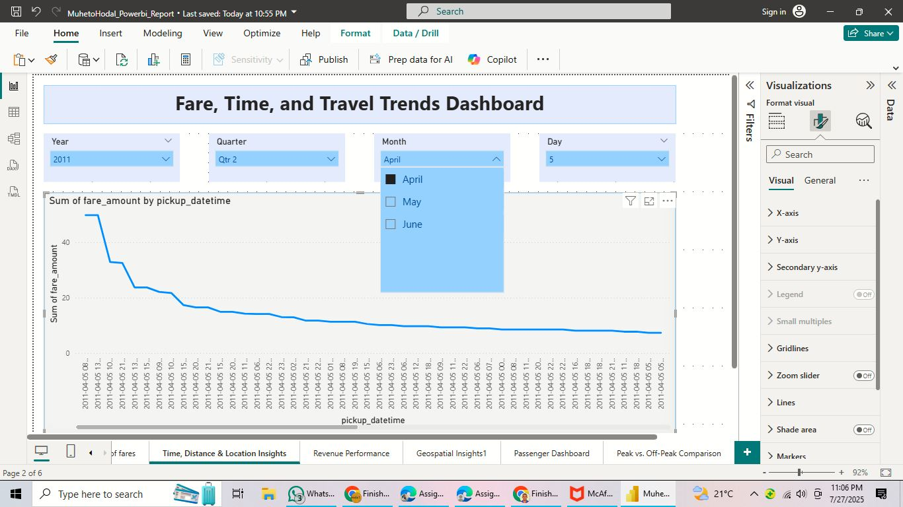
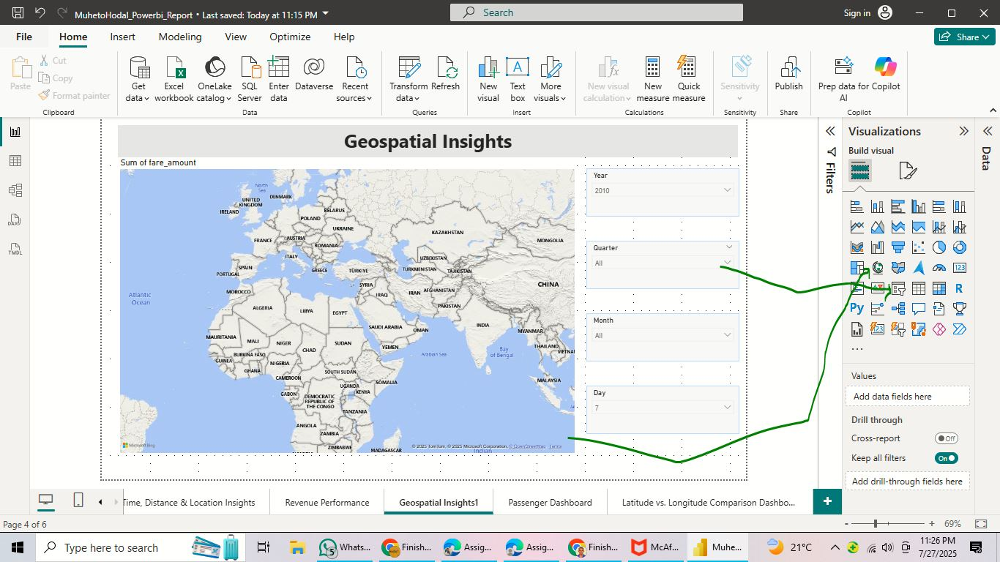
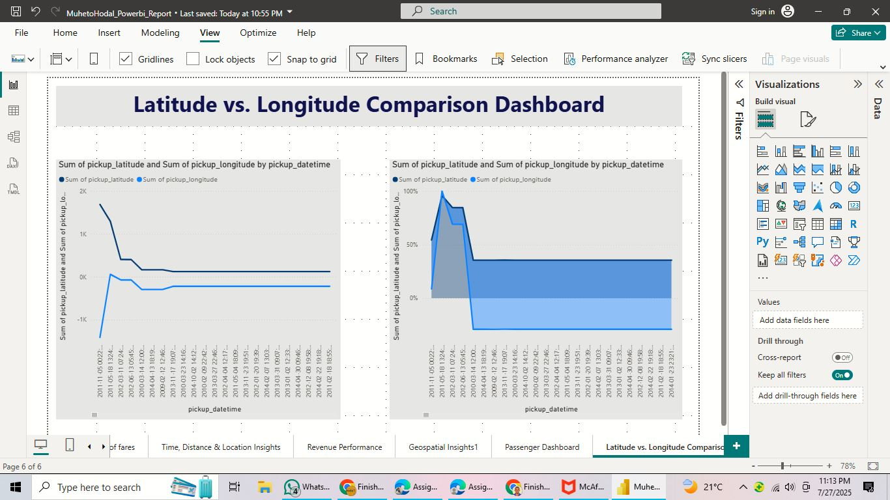
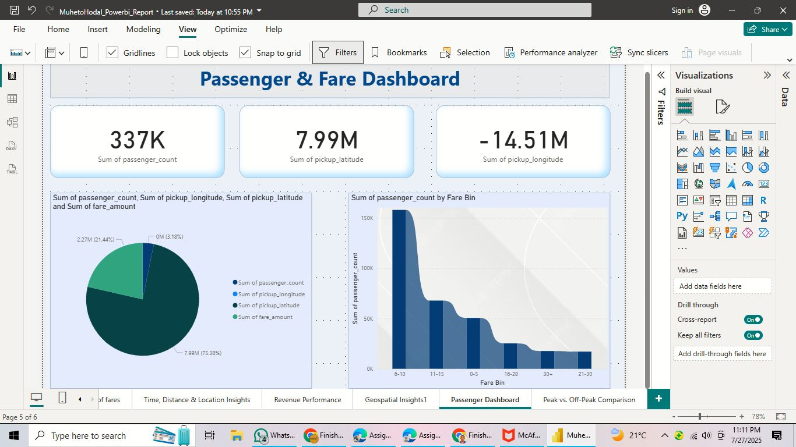
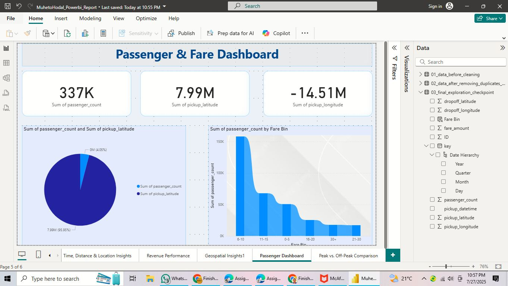
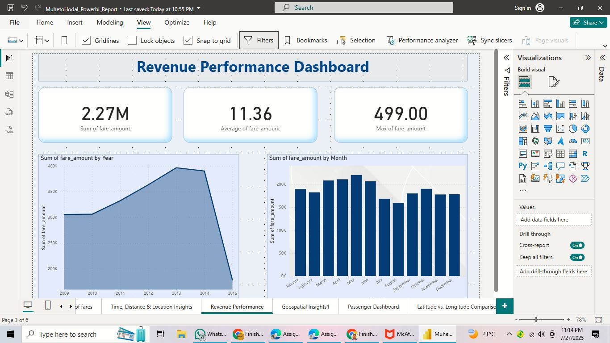

<h1 align="center">🚕 Uber Fares Analysis Dashboard – Power BI Project</h1>

<p align="center">
  <strong>Author:</strong> Hodal Muheto |
   <strong>ID</strong> 29049 |
  <strong>Course:</strong> INSY 8413 – Introduction to Big Data Analytics |
  <strong>Instructor:</strong> Eric Maniraguha |
  <strong>Group:</strong> A |
  <strong>Submission Date:</strong> 25 July 2025
</p>

---

## 🧠 Project Overview

This Power BI project analyzes Uber Fares to discover trends in pricing, ride demand, and location-based behaviors. Through data preprocessing in Python and interactive visualization in Power BI, this dashboard empowers users to explore fare distribution, ride duration, and operational metrics with professional visual storytelling.

---

## 🎯 Objectives

- Understand and clean the Uber dataset using Python.
- Engineer analytical features for time-based and spatial exploration.
- Visualize relationships between fare, distance, time, and pickup location.
- Build a multi-perspective Power BI dashboard with drill-down capability.
- Deliver professional documentation and a reproducible analytical report.

---

## 🧰 Tools & Technologies

- **Power BI Desktop**
- **Python (Pandas, Jupyter)**
- **Git & GitHub**
- **Dataset Source**: [Kaggle - Uber Fares Dataset](https://www.kaggle.com/datasets/yasserh/uber-fares-dataset)

---

## 📁 Repository Structure

```
.
├── cleaned_uber.csv
├── MuhetoHodal_Powerbi_Report.pbix
├── README.md
└── screenshots/
    ├── power_bi_dashboard/
    │   ├── Essential Data Transformations/
    │   ├── Fare Distribution Analysis/
    │   ├── dashboard_screen_shoots/
    │   └── background_images/
```

---

## 📊 Dashboard Overview

The final Power BI dashboard is composed of multiple interactive views:

### 🧭 Core Dashboard Features

- ⏱️ Filter by Hour, Day, and Peak/Off-Peak
- 📉 Fare vs. Distance Relationship
- 🕐 Fare vs. Time of Day
- 📅 Monthly and Seasonal Trends
- 🌍 Ride Location Mapping
- 💰 Revenue Performance Over Time

### 🖼️ Dashboard Screenshots

#### 🧮 Main Overview – Fare, Time & Travel Trends


#### 🌍 Geospatial Insights


#### 📍 Latitude & Longitude Map Dashboard


#### 👤 Passenger and Fare Analysis


#### 👥 Passenger Profile Dashboard


#### 💵 Revenue Performance View


---

## 🧹 Data Cleaning & Feature Engineering

### Performed in Python:
- Removed missing values and duplicates
- Converted timestamps into datetime objects
- Extracted:
  - `hour`, `day`, `month`
  - `day_of_week`
  - `peak` vs. `off-peak` indicator

### Transformed Fields:
- Cleaned column names
- Added calculated columns in Power BI
- Structured dataset for time-series and geo-mapping

#### 🧾 Cleaning & Transformation Screenshots


---

## 📌 Visualizations Summary

| Visualization Type         | Insights Delivered |
|----------------------------|--------------------|
| Histogram (Fare)           | Distribution of ride prices |
| Boxplot                    | Fare outliers detection |
| Line Chart (Time trends)   | Fare variation over hour/day/month |
| Map (Geo)                  | Location-based ride density |
| Scatter Plot               | Fare vs. Distance correlation |
| Revenue Dashboard          | Weekly/Monthly fare totals |
| Slicers                    | Hour, Day, Peak/Off-Peak filters |

---

## 🧾 Final Report Breakdown

| Section       | Description |
|---------------|-------------|
| **Introduction** | Uber fare analysis goals |
| **Methodology** | Python + Power BI workflow |
| **Findings** | Trends, peaks, outliers, fare behavior |
| **Results** | Correlations between fare, time, and distance |
| **Conclusion** | Fare behavior influenced by peak hours & locations |
| **Recommendations** | Pricing adjustments, marketing on peak zones |

---

## 📦 Deliverables

- ✅ `.pbix` file: Fully developed Power BI report
- ✅ `cleaned_uber.csv`: Cleaned dataset with engineered features
- ✅ Screenshots of:
  - Data loading & transformation
  - Dashboard designs and stages
- ✅ Professional `README.md` file

---

## 📬 Submission & Contact

> 📁 GitHub Repository: [Insert Link Here]  
> 📧 Instructor Email: eric.maniraguha@auca.ac.rw

---

## 🖼️ Background & Styling

The dashboard includes visual theming with background images to enhance clarity and professionalism.


---

## ✅ Notes

- All charts are interactive with slicers and tooltips.
- Designed with clean visual hierarchy and layout.
- Complies with assignment integrity and originality standards.

---

> _“Turning raw Uber data into strategic insights through visual storytelling.”_
